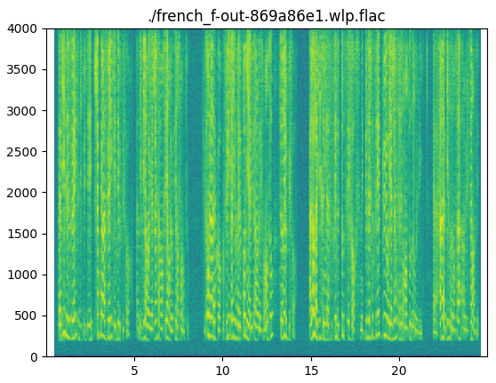

# warped linear prediction coding

### Intro

>Warped linear predictive coding (warped LPC or WLPC) is a variant of linear predictive coding in which the spectral representation of the system is modified, for example by replacing the unit delays used in an LPC implementation with first-order allpass filters. This can have advantages in reducing the bitrate required for a given level of perceived audio quality/intelligibility, especially in wideband audio coding.

https://en.wikipedia.org/wiki/Warped_linear_predictive_coding

This repository contains an introduction to warped linear prediction through Jupyter notebooks in the [gh-pages branch](https://github.com/sevagh/warped-linear-prediction/tree/gh-pages), viewable at https://sevagh.github.io/warped-linear-prediction.

### WLPAC codec description

WLPAC, or "Warped Linear Prediction Audio Codec", is an audio codec. In this repository I use wlpac to refer to an experimental new audio file format based on the WLPC residual in a FLAC container - files are stored with the extension `.wlp.flac`.

Input files should be uncompressed WAV files. Space savings are measured compared to the original WAV file, and the PESQ and spectrogram are taken straight from the `.wlp.flac` file.

You can play `.wlp.flac` files with any media player, e.g. mpv, making this a well-suited general purpose audio codec.

Every implementation starts at **stage 1**, using WLP to find the [residual signal](https://sevagh.github.io/warped-linear-prediction/Listening%20tests%2C%20speech%20and%20music.html), which should be a smaller signal than the original. Optional parameters to stage 1 are the quantization ratio, and Huffman encoding. This is followed by a pass at **stage 2** to store the residual using FLAC as a container.

Decompression is done by extracing the residual signal from the FLAC container and [reconstructing the original signal](https://sevagh.github.io/warped-linear-prediction/Reconstructing%20the%20original%20signal.html) by reversing the Warped FIR procedure.

### Results

Compression results with filesizes for WLPAC and regular FLAC:

| File     | WLPAC compression (%) | WLPAC PESQ\*   | FLAC compression\*\* (%) |FLAC PESQ   |
|----------|-----------------------|----------------|--------------------------|------------|
|english_m | 65                    | 4.50           | 67                       | 4.55       |
|english_f | 67                    | 4.52           | 69                       | 4.55       |
|french_m  | 66                    | 4.51           | 70                       | 4.55       |
|french_f  | 64                    | 4.53           | 68                       | 4.55       |

\*: quality is calculated with [PESQ](https://github.com/ludlows/python-pesq), Perceptual Evaluation of Speech Quality. The results are given for 4 clips, 2 male and 2 female speech clips (English and French) with the maximum possible PESQ of 4.5, taken from https://www.signalogic.com/index.pl?page=speech_codec_wav_samples and included in the samples dir.

\*\*: FLAC compression without WLP tested with ffmpeg

Note the extra space savings over regular FLAC compression with a small hit in quality. In my personal listening tests, I don't notice a difference.

#### Spectrograms

| Original | WLPAC | FLAC |
|----------|-------|------|
|  |  |  |
|  |  |  |
|  |  |  |
|  |  |  |

### Installation and usage

On the master branch, there is a Python 3 package, `wlpac`, which contains a library and some command line tools for working with wlpac:

* `wlpac_encode` - convert a WAV file to a wlpac file, with your choice of stage 2 container
* `wlpac_decode` - convert a wlpac file to a WAV file
* `wlpac_compare` - output a PESQ score and spectrogram from input audio files ('.wlp.flac' supported)

There's a setup.py and requirements.txt file. Everything has been verified to work on Python 3.8.

### Footnote - 2020-06-12 update

In the original Jupyter notebooks, I used several compression techniques, including quantization, Huffman encoding, lzma and pickle to create custom file formats for the WLPAC (similar to https://github.com/sevagh/quadtree-compression). After further (unsuccessful) experimentation with other data compression algorithms include bz2 and zlib, I changed track to rely on a real audio codec, FLAC, as a container for the WLPC residual.
